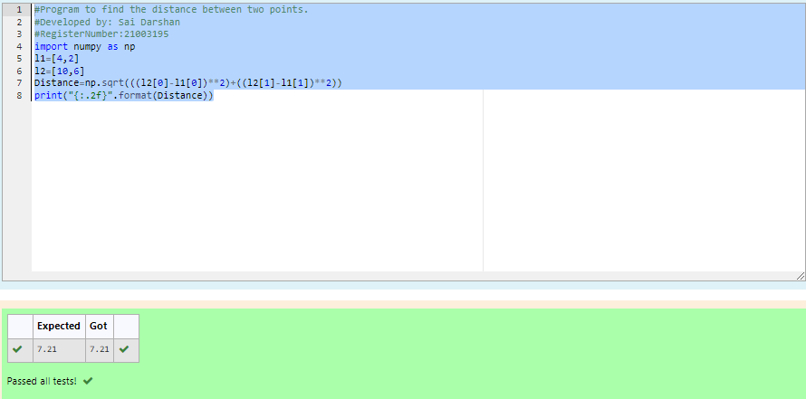

# DISTANCE-BETWEEN-TWO-POINTS

## AIM:
To write a python program to find the distance two 2 points
## ALGORITHM:
### Step 1: 
Import numpy into the editor
### Step 2: 
Input the co-ordinates from the user.
### Step 3: 
Substitute the values in the distance formula  
### Step 4: 
Print the solution.
### Step 5: 
End the program
### PROGRAM:
~~~
  #Program to find the distance between two points.
#Developed by: Sai Darshan
#RegisterNumber:21003195
import numpy as np
l1=[4,2]
l2=[10,6]
Distance=np.sqrt(((l2[0]-l1[0])**2)+((l2[1]-l1[1])**2))
print("{:.2f}".format(Distance))
~~~

### OUTPUT:

### RESULT:
The distance between the two points is displayed sucessfully.